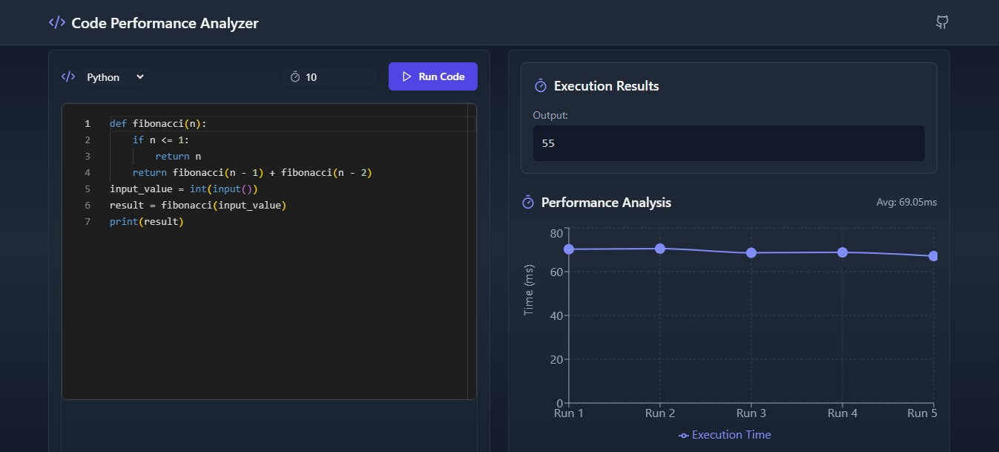
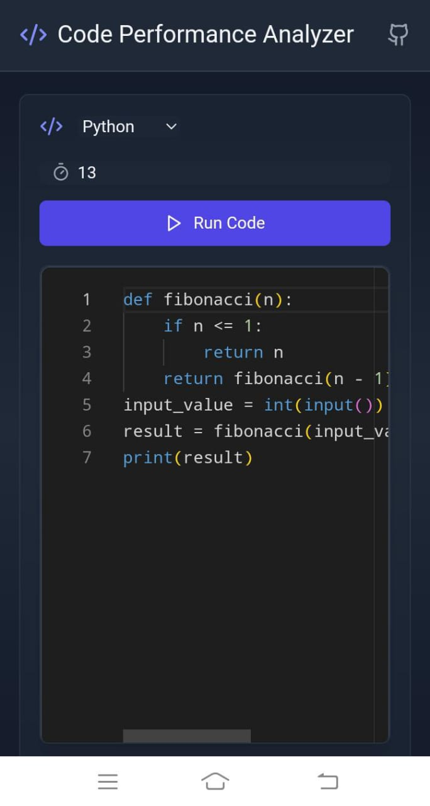

# 🎯 **Code Performance Visualizer**

The **Code Performance Visualizer** is an interactive web application that lets you run code snippets in multiple programming languages and visualize their performance in real-time. You can compare execution times and performance metrics to optimize your code effectively.

---

## 🚀 **Live Demo**

Experience the full functionality of the **Code Performance Visualizer** by visiting the live site:  
[**Try it now**](https://zaidimurtaza.github.io/Function-Performance/)

---

## 🔥 **Features**

- 🔄 **Support for Multiple Languages**: Run code in Python, JavaScript, and more.
- ⚡ **Real-Time Performance Analysis**: View execution times and other performance metrics instantly.
- ✨ **Interactive Code Editor**: Modify code on the fly and see results in real-time.
- 💡 **User-Friendly Interface**: Clean, modern interface for an enjoyable user experience.

---

## 🖼️ **Screenshots**

### 1. **Main Dashboard**
The home interface of the app where you can select your programming language and input.

---

### 2. **Mobile View**
The interactive code editor where you can input code and run it instantly and Get the Output as a Graph.

---

## 🛠️ **Technologies Used**

- **React** for building the frontend user interface.
- **Axios** for making HTTP requests to the backend.
- **Tailwind CSS** for fast and responsive styling.
- **Flask API** (Python): A lightweight and powerful framework for handling backend API requests and executing code securely.
- **Subprocess** (Python): Used for running code in different programming languages on the backend, ensuring safe and efficient execution.

---

## 📜 **License**

This project is licensed under the **MIT License**. See the [LICENSE](LICENSE) file for more details.

---

## 💬 **Contact**

For questions, collaborations, or feedback, feel free to reach out to me on:

- [GitHub](https://github.com/zaidimurtaza)
- [LinkedIn]((https://www.linkedin.com/in/murtaza-57816b302/))

---

## 💡 **Acknowledgements**

Thank you to the open-source community and contributors who helped make this project possible!

---

## 🌐 **Visit the Live App**

Don't forget to explore and experience the app yourself:  
[**Code Performance Visualizer**](https://zaidimurtaza.github.io/Function-Performance/)
